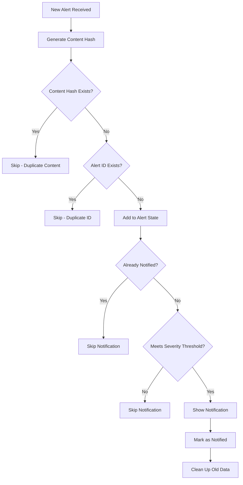

# Alert System Deduplication - Anti-Spam Protection

## 🚫 Problem Solved

**Before**: Users would receive multiple notifications for the same or similar alerts, causing notification spam and poor user experience.

**After**: Smart deduplication system prevents duplicate notifications while maintaining alert history for reference.

## 🧠 How It Works

### 1. **Content-Based Deduplication**
```typescript
// Generates hash from title, type, and summary
const contentHash = generateContentHash(alert)
// Example: "suimajorpartnership_breaking_news_majorpartnership" → "c3VpbWFqb3JwYXJ0"
```

### 2. **Multi-Layer Protection**
- ✅ **ID Deduplication**: Prevents exact same alert ID from being processed twice
- ✅ **Content Hash Deduplication**: Prevents similar content from generating multiple alerts
- ✅ **Notification Tracking**: Prevents re-notification of already notified alerts
- ✅ **Time-Based Cleanup**: Automatically cleans up old tracking data

### 3. **Smart Notification Logic**
```typescript
const shouldNotify = notifyAlert(alert)
if (shouldNotify) {
  // Show toast and modal
} else {
  // Skip notification (already shown or duplicate)
}
```

## 🔧 Configuration

### Deduplication Settings
Located in `alertSystemAtom.settings`:

```typescript
settings: {
  enabled: true,                    // Enable/disable alert system
  pollInterval: 3000,              // Poll every 3 seconds
  severityThreshold: 'medium',     // Minimum severity to show
  deduplicationWindow: 60          // 60 minutes deduplication window
}
```

### Customizable Parameters
- **Deduplication Window**: How long to remember alerts (default: 60 minutes)
- **Severity Threshold**: Minimum severity level to show notifications
- **Content Hash Algorithm**: Based on title + type + summary

## 📊 Tracking Systems

### 1. **Notification Tracking**
```typescript
notifiedAlerts: Set<string>  // Tracks alert IDs that have been notified
```
- Prevents re-notification of the same alert
- Automatically cleaned up after deduplication window

### 2. **Content Hash Tracking**
```typescript
seenContentHashes: Set<string>  // Tracks content hashes
```
- Prevents similar content from generating multiple alerts
- Uses content-based hashing for similarity detection

### 3. **Alert History**
```typescript
alerts: AlertData[]  // Keeps last 50 alerts for reference
```
- Maintains history for user review
- Limited to 50 alerts to prevent memory issues

## 🎯 User Experience Benefits

### ✅ **No Spam Notifications**
- Users only see each unique alert once
- Similar alerts are deduplicated automatically
- Critical alerts still show immediately

### ✅ **Smart Timing**
- 60-minute deduplication window prevents short-term spam
- Old alerts are forgotten and can trigger again if relevant
- Real-time processing with immediate feedback

### ✅ **Transparent Logging**
```
🔔 Notification allowed for alert: SUI Major Partnership
🔄 Skipping duplicate alert: SUI Major Partnership (similar)
🔕 Skipped notification for alert: SUI Price Update (below threshold)
```

## 🧪 Testing the Deduplication

### Method 1: Browser Console
Watch for deduplication logs:
```
🔄 Skipping duplicate alert: [Alert Title]
🔕 Skipping notification for already notified alert: [Alert Title]
🔔 Notification allowed for alert: [Alert Title]
```

### Method 2: Test Page
1. Visit `/test-alerts`
2. Click "Test Alert API" multiple times
3. Observe that notifications only appear once

### Method 3: Manual Testing
```javascript
// In browser console
const alertState = window.__JOTAI_DEVTOOLS_STORE__.get(alertSystemAtom)
console.log('Notified Alerts:', alertState.notifiedAlerts)
console.log('Seen Content Hashes:', alertState.seenContentHashes)
```

## 🔍 Deduplication Logic Flow



## 🛠️ Advanced Configuration

### Custom Deduplication Window
```typescript
// Set to 30 minutes
updateAlertSettings({ deduplicationWindow: 30 })

// Set to 2 hours
updateAlertSettings({ deduplicationWindow: 120 })
```

### Severity Threshold Adjustment
```typescript
// Only show high and critical alerts
updateAlertSettings({ severityThreshold: 'high' })

// Show all alerts
updateAlertSettings({ severityThreshold: 'low' })
```

### Manual Cleanup
```typescript
// Clear all tracking data
clearAlerts()

// This will reset:
// - alerts: []
// - notifiedAlerts: new Set()
// - seenContentHashes: new Set()
```

## 📈 Performance Benefits

### Memory Management
- **Automatic cleanup** of old tracking data
- **Limited alert history** (50 alerts max)
- **Efficient Set operations** for O(1) lookups

### Network Efficiency
- **Reduced redundant processing** of duplicate alerts
- **Smart polling** continues without interruption
- **Graceful error handling** maintains system stability

### User Experience
- **No notification fatigue** from duplicate alerts
- **Immediate feedback** for new, relevant alerts
- **Transparent operation** with detailed logging

## 🎉 Success Indicators

✅ **Working Correctly When:**
- Same alert content only notifies once
- Console shows deduplication logs
- Notification count matches unique alerts
- Old alerts can trigger again after window expires
- System performance remains smooth

✅ **Console Logs to Watch For:**
```
🔄 Skipping duplicate alert: [Title]
🔕 Skipping notification for already notified alert: [Title]
🔔 Notification allowed for alert: [Title]
✅ Added new alert: [Title]
```

The deduplication system ensures users get timely, relevant alerts without notification spam! 🎯
